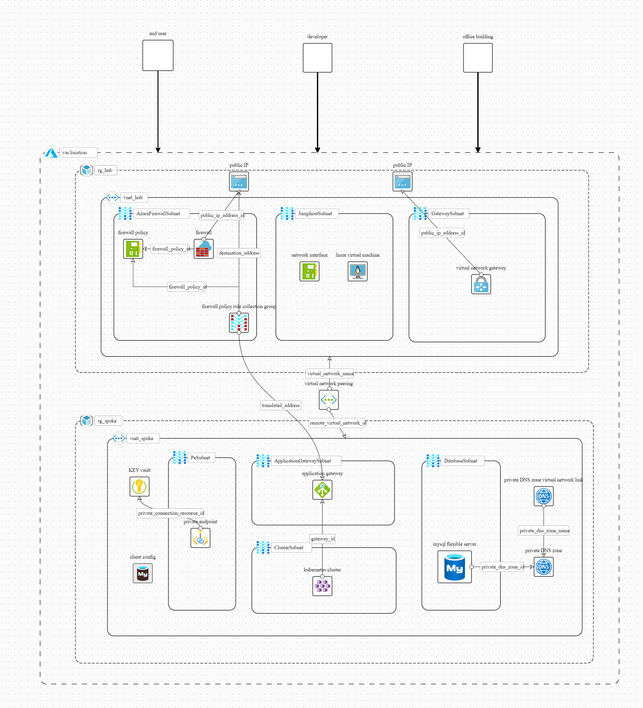

# Terraform mini cloud adoption framework landing zone


[Azure Landing Zone Masterclass](https://youtu.be/ErnP5Yo6NqU)

---

## to get output of a terraform plan as json

```bash
terraform plan -out=./out.txt
terraform show -json ./out.txt > out.json
```

---

## to see a cost breakdown

```bash
infracost breakdown --path .
```

---

## some terraform notes

```bash
terraform apply -auto-approve
terraform plan -destroy -auto-approve
```

---
